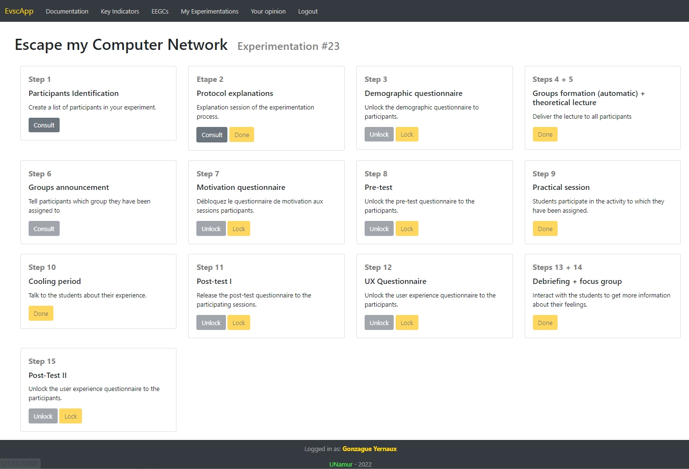
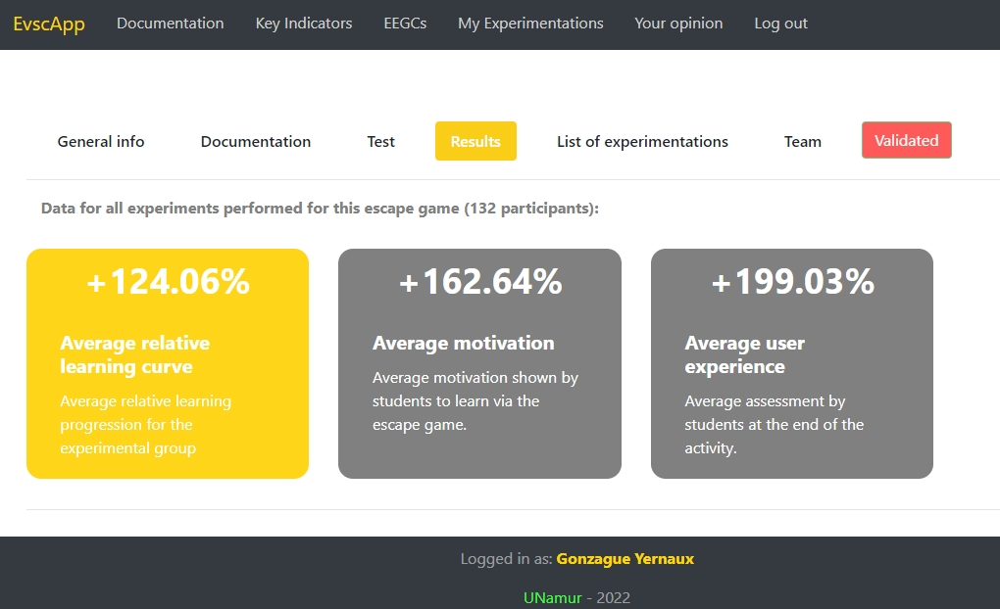
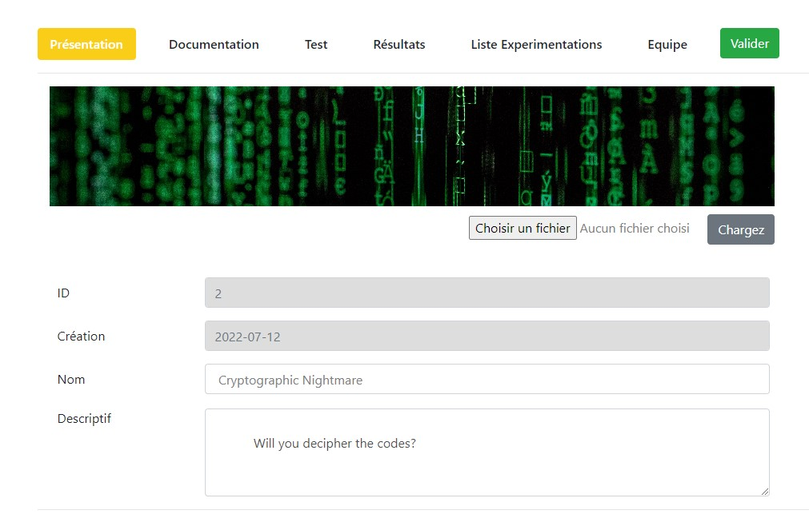
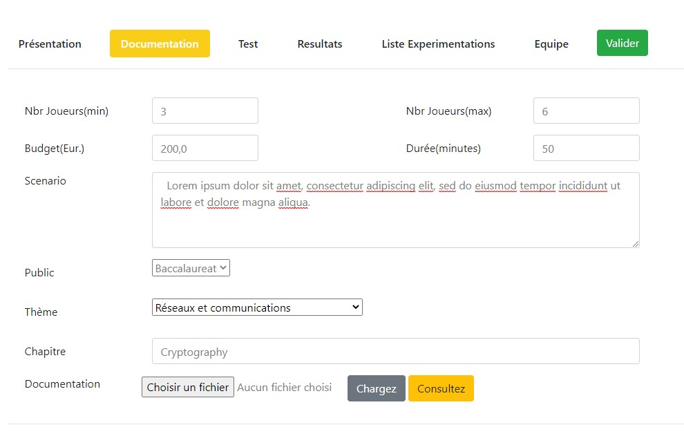
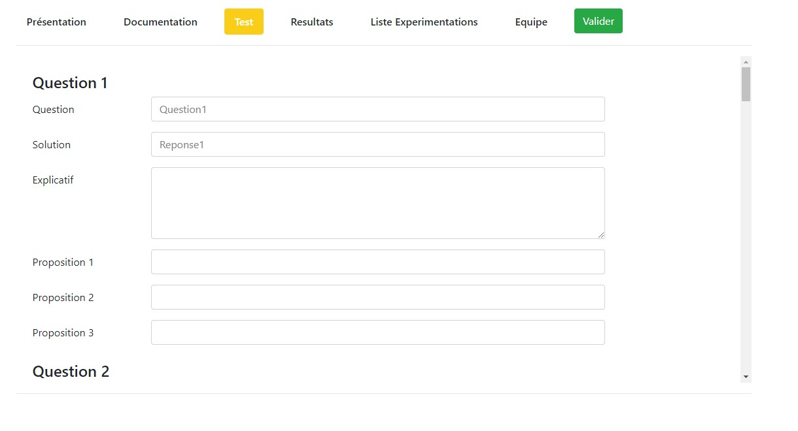

# EvscApp
EvscApp is is a quasi-experimental evaluation framework that aims to measure the educational effectiveness of Educational Escape Games for Computer Science (EEGC) by collecting standardized and rigorous empirical data.
Thanks to EvscApp, EEGC designers can avoid the heavy work of producing and justifying their evaluation protocol. It also makes it possible to compare the EEGCs that have been evaluated by EvscApp with one another and to replicate the experiments by sharing their specifications. 

This repository contains the EvscApp Web application, designed to assist researchers at all steps of the encoding and evaluation process. It has been built using the Flask (Python) framework. See [the official Flask documentation](https://flask.palletsprojects.com/en/2.1.x/).

## Start guide
* Download the repository.
* Make sure you have a directory called `db/` (at the root of the project)
* Make sure you have a directory `my_app/static/img/`
* To start the application, open a command prompt at the project's root and type `python run.py` to execute script `run.py` which will start the application server.
* In a browser, go to the local server's address as stated in the console. The address should be something like `http://127.0.0.1:5000/`
* You can now register an account and encode your pedagogical escape games to start experimenting with the EvscApp methodology. Congrats! 

## Additional notes
* The application is, for the moment, in French only. We are working on an English version. Coming soon!

## Screenshots
### The experimental dashboard (englified)

### The results page for an EEGC (englified)

### The forms for EEGC information

### The form for creating a test relative to the EEGC thematic

